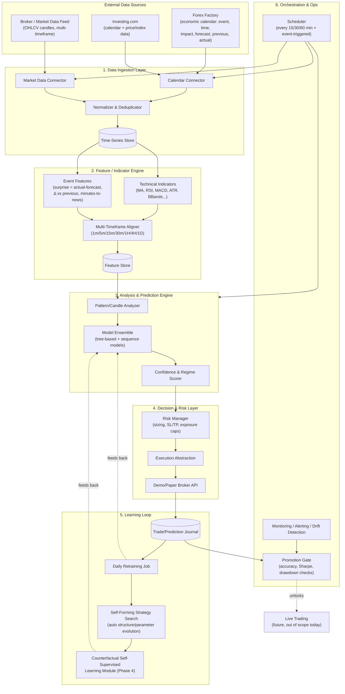

# AI-Driven Forex Trading Bot — Full System Architecture

> Data-fusion trading system that combines economic-calendar data (Forex Factory, Investing.com), multi-timeframe price/indicator analysis, and a self-improving learning loop — starting in demo mode, evolving its own model/strategy structure over time, and gated by measured accuracy before any live-capital decision.

**Scope note:** this document is a *system/software architecture*, not investment advice. Nothing here guarantees profitability — markets are noisy and non-stationary, and even a well-built pipeline needs a long, honestly-measured demo period (see Phase 4/5) before any live-capital discussion.

---

## 1. Design Principles

1. **Paper/demo-first, always.** No component ever touches a live order until it passes the promotion gate in Section 8.
2. **Everything is a tool, not a script.** Data fetchers, indicator calculators, and analyzers are discrete, callable tools with typed inputs/outputs — this is what lets the AI layer orchestrate and later *recompose* them on its own.
3. **Separation of signal and execution.** The prediction engine never places an order directly; it emits a signal that a risk/execution layer evaluates independently. This makes the system safer and easier to audit.
4. **Everything is logged for the future learner.** Every prediction, the features behind it, and the eventual outcome are stored — this trade journal *is* the training data for the self-learning and counterfactual modules later.
5. **Compliance by design.** Forex Factory and Investing.com both have Terms of Service governing automated access. Architect the ingestion layer around this from day one (see Section 3.4) rather than retrofitting it later.
6. **Explainability over black-box.** Every signal should carry a "why" (which features/events drove it) — critical both for debugging and for the self-supervised learner to form correct associations.

---

## 2. High-Level Architecture

---

## 3. Layer 1 — Data Ingestion Tools

This is the layer you build **first**. Each source becomes its own tool the AI layer can call independently.

### 3.1 Forex Factory Calendar Tool
- **Fields captured per event:** currency, event name, scheduled time (UTC-normalized), impact level (low/med/high), forecast, previous value, actual value (once released).
- **Derived fields to compute immediately on ingest:**
  - `surprise = actual − forecast`
  - `revision = actual − previous`
  - `minutes_to_release` / `minutes_since_release` (relative clock, used everywhere downstream)
- **Output contract:** normalized JSON/row per event, one row updated in place as forecast → actual becomes available (so the tool must support upserts, not just inserts).

### 3.2 Investing.com Tool
- **Fields:** overlapping economic calendar (useful for cross-checking Forex Factory — sources occasionally disagree on impact rating or exact time) plus instrument-level data (indices, commodities, related pairs) if you want cross-asset context.
- Treat this as a **secondary/confirmatory source** for calendar data and a **primary source** for any instrument data Forex Factory doesn't cover.

### 3.3 Market/Price Data Tool
- Pulls OHLCV candles from your actual broker/data vendor (Forex Factory/Investing.com are not reliable venues for live tick/candle data — use a proper market data API or your demo broker's feed, e.g. OANDA, MT5, Alpaca, a licensed data vendor).
- Must support **parallel multi-timeframe pulls**: 1m, 5m,15m, 30m, 1H, 4H, 1D minimum, so the analysis layer can look at "different angles" as you described.

### 3.4 Normalization, Storage & Compliance
- All three feeds converge into one **normalizer** (consistent timestamps/UTC, consistent currency-pair naming, deduplication).
- Store in a time-series database (TimescaleDB/InfluxDB) — this is your single source of truth for both live inference and future training.
- **Compliance layer:** respect robots.txt/ToS, rate-limit requests, cache aggressively (calendar data doesn't need re-fetching every minute), and prefer official APIs or licensed feeds over scraping wherever one exists. Build this as a policy the connector enforces, not an afterthought.

---

## 4. Layer 2 — Indicator & Feature Engine

- **Technical indicator tool:** a library-backed calculator (e.g. wrapping `ta-lib`/`pandas-ta`) exposing indicators as callable functions per timeframe: moving averages, RSI, MACD, ATR, Bollinger Bands, stochastic, volume-based indicators, support/resistance levels, candlestick pattern flags.
- **Event-feature tool:** turns calendar rows into model-ready features — impact-weighted surprise scores, "news window" flags (e.g. ±30 min around high-impact releases), historical reaction magnitude for that event type/currency.
- **Multi-timeframe aligner:** the core of "analyzing from different angles" — joins the same instant in time across all timeframes so the model can see e.g. "1H trend up, but 5m showing exhaustion, and we're 12 minutes from a high-impact NFP release" as one feature vector.
- **Feature store:** versioned, so you can always reproduce exactly what features a past prediction was based on (essential for the learning loop and for debugging).

---

## 5. Layer 3 — Analysis & Prediction Engine

- **Pattern/candle analyzer:** rule-based + learned candlestick/chart pattern detection (engulfing, pin bars, breakout structures) per timeframe.
- **Model ensemble:** start simple and add complexity only as data volume justifies it.
  - Baseline: gradient-boosted trees (XGBoost/LightGBM) on the engineered feature set — strong, fast, interpretable starting point.
  - Sequence models (LSTM/Transformer) once you have enough history, for raw multi-timeframe price sequences.
  - Ensemble/stacking layer combining both, plus the event-driven features.
- **Confidence & regime scorer:** outputs not just a direction but a confidence score and a "regime" tag (trending/ranging/high-volatility-news-window) — this matters a lot for the risk layer and for honestly measuring accuracy later (a model can be very accurate in one regime and useless in another).
- **Output contract:** `{instrument, timeframe, direction, confidence, horizon, driving_features, regime}` — this is what gets journaled and what the learning loop trains against.

---

## 6. Layer 4 — Decision, Risk & Execution

- **Risk manager:** position sizing rules, stop-loss/take-profit placement, max daily loss, max concurrent exposure, and a **hard veto** during extreme-impact news windows if desired.
- **Execution abstraction:** one interface (`place_order`, `close_position`, `get_positions`) implemented first against a **demo/paper broker API**. Keeping this abstracted means swapping demo → live later is a config change, not a rewrite.
- Every order (demo, for now) is logged with the full context that produced it — this is what turns your demo phase into genuine training data rather than just a scoreboard.

---

## 7. Layer 5 — Self-Learning Loop (this is the heart of what you're describing)

### 7.1 Trade/Prediction Journal
Every cycle logs: input features → prediction → (later) realized outcome. This journal is the ground truth for everything below.

### 7.2 Daily/Periodic Retraining
- Scheduled job (e.g. nightly) retrains models on the accumulated journal + fresh market data.
- Tracks every model version, hyperparameters, and resulting backtest/demo metrics (use MLflow or similar) so you can always answer "did today's retrain actually improve anything?"

### 7.3 Self-Forming Strategy/Architecture Search
This is what lets the bot "form algorithm structure by itself" rather than you hand-tuning it:
- **Hyperparameter/architecture search** (Optuna, or a genetic-algorithm/evolutionary search) over model structure and feature subsets, scored against walk-forward validation — not just in-sample fit.
- **Strategy-parameter evolution:** treat entry/exit rules, indicator thresholds, and timeframe weighting as evolvable parameters, mutated/selected based on demo performance over rolling windows.
- Guardrail: cap how much the structure can change per cycle, and always validate a candidate structure on held-out recent data before it replaces the running model.

### 7.4 Counterfactual Self-Supervised Learning (CSSL) — Future Phase
Once the base loop above is stable and you have a healthy journal, add this as a deeper learning layer:
- **Self-supervised pretraining:** learn representations of price/event sequences without labels — masked-sequence prediction or contrastive learning ("does this window belong with this future window or a random one?"), so the model builds a general sense of market structure before ever seeing a trading label.
- **Counterfactual estimation:** for every historical decision point, estimate what *would* have happened under the actions *not* taken (hold instead of buy, different position size, ignore vs. act on a given news event). This is the core idea behind counterfactual policy evaluation / offline RL — it lets the bot learn from the paths it didn't take, not just the one it did, which is much more data-efficient.
- **Why this fits here:** your journal from Phase 3–5 (below) is exactly the offline dataset this needs. Don't build CSSL until you have that data — it has nothing to learn from otherwise.

---

## 8. Layer 6 — Orchestration, Monitoring & the Promotion Gate

### 8.1 Scheduler
- Base cadence: every 15/30/60 min (configurable) for routine analysis.
- **Event-triggered runs**: an extra pass fired a few minutes before/after any high-impact calendar release, since that's when the "different angles" analysis matters most.
- Airflow, Prefect, or even a well-structured cron + job queue are all reasonable depending on scale.

### 8.2 Monitoring & Drift Detection
- Track feature drift (are today's inputs statistically different from training data?) and prediction-confidence calibration (when the model says 70% confident, is it actually right ~70% of the time?).
- Alert on data-feed gaps/failures — a silent broken connector is worse than an obviously broken one.

### 8.3 Promotion Gate (demo → any live discussion)
Define this **before** you start, so success/failure is measured against a pre-committed bar, not decided after the fact:
- Minimum sample size of demo trades (statistically meaningful, not 10 lucky trades).
- Walk-forward validated accuracy/edge, not just in-sample.
- Risk-adjusted metrics: Sharpe/Sortino ratio, max drawdown, profit factor.
- Confidence calibration check (Section 8.2).
- Stability across different market regimes (trending vs ranging vs high-news-volatility periods).
- A documented kill-switch/circuit-breaker plan for the eventual live phase.

---

## 9. Suggested Technology Stack

| Layer | Suggested tools |
|---|---|
| Ingestion | Python (`requests`/`httpx`, `playwright` if rendering needed), scheduler-triggered connectors |
| Storage | TimescaleDB or InfluxDB (time-series), PostgreSQL (metadata/journal), Redis (caching/queues) |
| Indicators | `pandas-ta` / `ta-lib` |
| ML | `scikit-learn`, `XGBoost`/`LightGBM`, `PyTorch` (sequence models) |
| Experiment tracking | MLflow or Weights & Biases |
| Architecture/hyperparam search | Optuna, or a custom evolutionary search |
| Orchestration | Airflow or Prefect |
| Execution | Broker demo API (OANDA, MT5, Alpaca, IBKR paper) behind a common interface |
| Monitoring | Grafana + Prometheus, or a lightweight custom dashboard |
| Serving | FastAPI for internal tool endpoints |

---

## 10. Phased Roadmap

| Phase | Goal | Key deliverable |
|---|---|---|
| **0 — Foundations** | Data ingestion tools | Forex Factory + Investing.com connectors, market data connector, normalized storage |
| **1 — Feature tools** | Indicator & event-feature engine | Multi-timeframe aligned feature store |
| **2 — Baseline analysis** | Rule-based + first ML signals | Prediction engine v1, fully logged |
| **3 — Demo trading loop** | Close the loop end-to-end | Risk manager + demo execution + journal, running on schedule |
| **4 — Self-learning** | Daily retrain + structure search | Model/strategy improves automatically from the journal |
| **5 — Extended validation** | Weeks–months of demo running | Accuracy/edge measured against the Section 8.3 gate |
| **6 — CSSL integration** | Add counterfactual self-supervised learning | Deeper learning from the accumulated offline journal |
| **7 — Go/no-go decision** | Evaluate gate results | Documented decision, informed by real metrics — not by this document |

---

## 11. Open Design Questions to Resolve Before Building

- Which currency pairs / instruments are in scope initially (fewer pairs = faster path to a statistically meaningful journal)?
- Which demo broker/API will supply the actual price feed and paper execution?
- What's the minimum viable feature set for Phase 2, so you're not blocked waiting for the full indicator suite?
- How will you version and roll back a model/strategy structure if a self-formed change performs worse, not better?

# Addition info to be aware and needed 

## Addendum — Extra Data Sources & Auto Entry/SL/TP Logic

### A. Data That Would Meaningfully Deepen the Model

Add these gradually — don't try to ingest everything on day one, or Phase 0 never ends.

- **Order flow / COT reports** (positioning data — real supply/demand, not just price)
  - Source: CFTC Commitment of Traders report (free, weekly, `cftc.gov`)
- **Correlated instruments** (DXY, bond yields, related FX pairs, gold/oil) — currency moves rarely happen in isolation
  - Source: your existing market data feed/broker API (just add the extra tickers), or free sources like Yahoo Finance/Stooq for indices & yields
- **Sentiment data** (retail positioning % long/short from brokers, options skew if available)
  - Source: broker-published sentiment (e.g. OANDA Order Book, IG Client Sentiment, MyFXBook Community Outlook — all free/public)
- **Volatility regime data** (implied vol, ATR percentile) — same signal means different things in calm vs volatile regimes
  - Source: computed yourself from your OHLCV feed (ATR percentile), or CBOE/vol-index data for broader market vol context
- **Higher-resolution tick/order-book data** if you ever want more precision than candle closes give you
  - Source: your broker's tick-level API/data feed (usually a paid tier beyond basic OHLCV)

### B. Auto Entry / Stop-Loss / Take-Profit Logic

Expansion of the Decision & Execution Layer (Section 6):

- **Entry logic:** trigger only when signal + confidence threshold + risk checks all pass (not just raw prediction).
- **Dynamic Stop Loss:** initial SL (e.g. ATR-based), then a trailing rule — moves to breakeven once price moves X% in favor, then trails by a fixed distance or a volatility-based step as profit grows.
- **Take Profit:** fixed target, partial scale-out (close 50% at TP1, trail rest), or fully dynamic based on momentum decay.